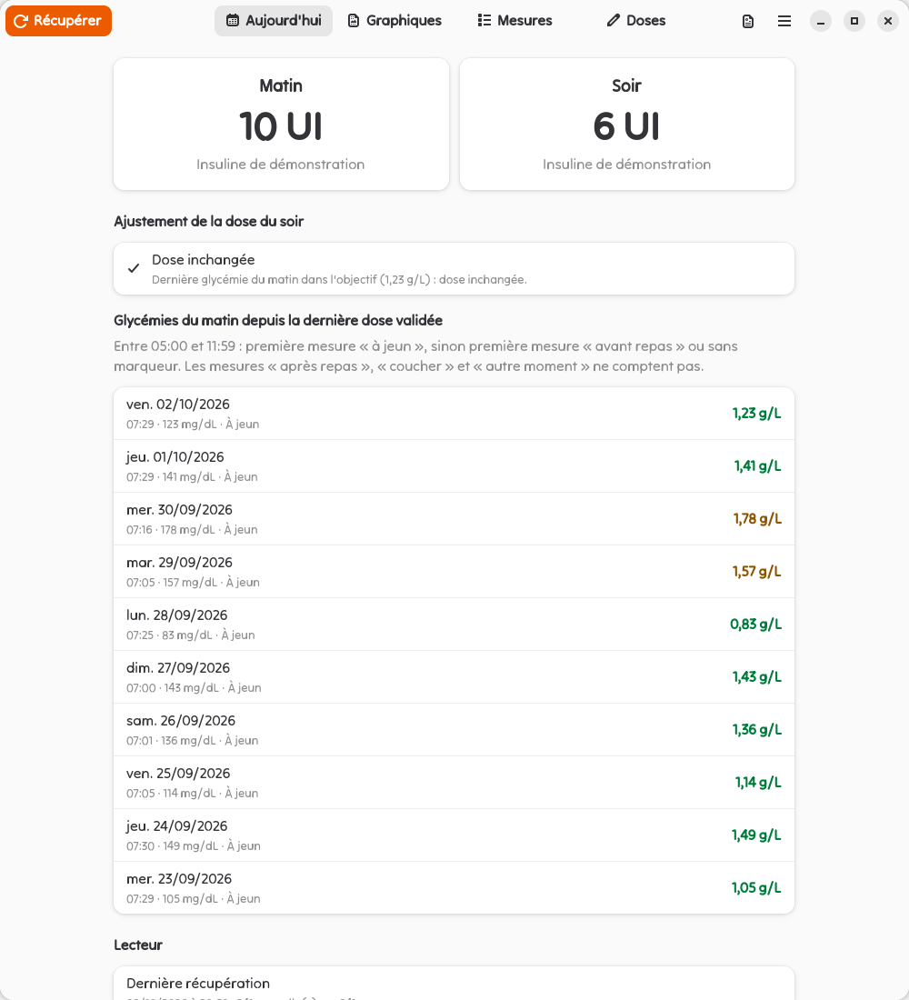
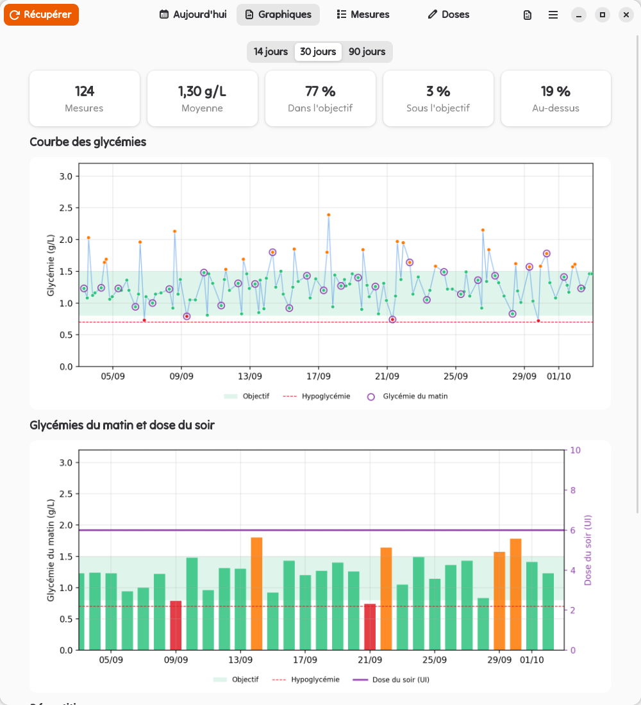
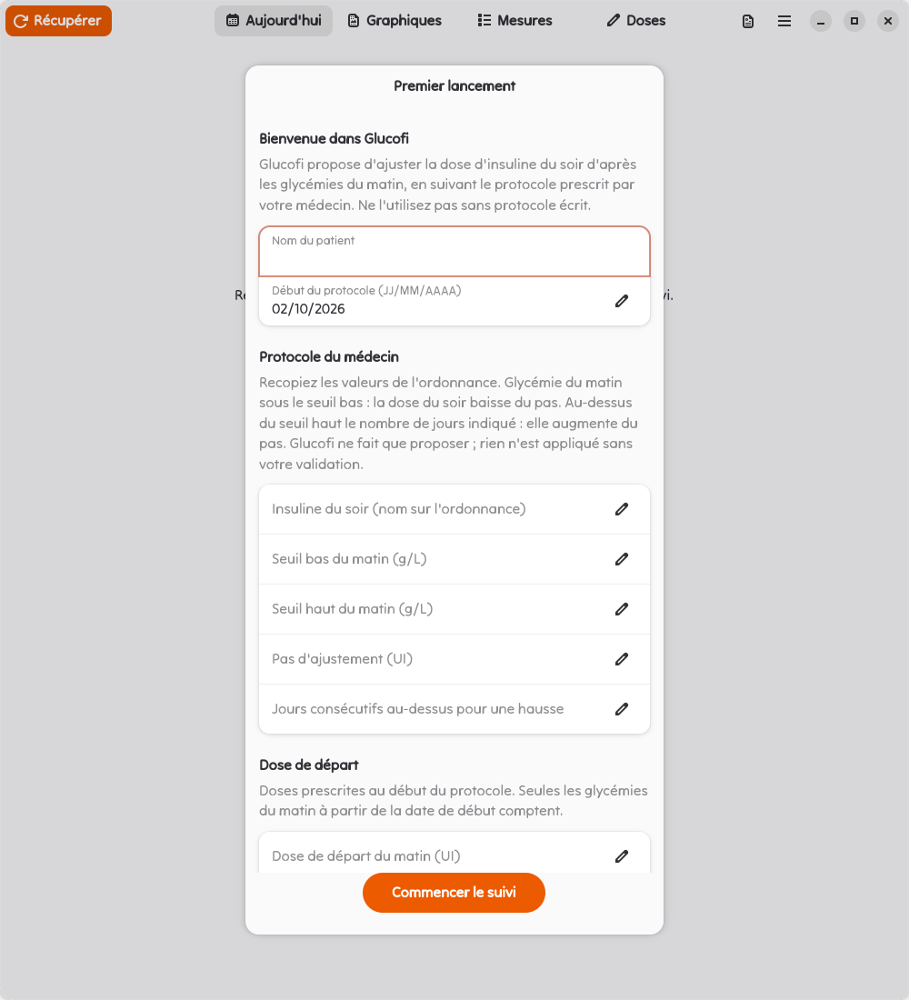

<p align="center">
  
</p>

<h1 align="center">Glucofi</h1>

<p align="center">
  Suivi glycémique avec un lecteur <b>Accu-Chek Guide</b> branché en USB, et proposition d'ajustement de la dose d'insuline du soir selon le protocole de <b>votre</b> médecin.
</p>

Application GTK4 / libadwaita pour Linux (Gnome) :

- récupération des mesures d'un clic (ou import d'un export JSON), stockage local, utilisable hors ligne, aucune donnée envoyée nulle part ;
- dose du matin et du soir, avec proposition d'ajustement de la dose du soir d'après les glycémies du matin, **validée manuellement** ;
- graphiques (14 / 30 / 90 jours) et export **PDF** pour le médecin.

<p align="center">
  
  
  
</p>
<p align="center"><sub>Captures réalisées avec des mesures et un protocole fictifs (<code>python3 -m scripts.demo_export</code>).</sub></p>

> [!WARNING]
> **Glucofi n'est pas un dispositif médical et ne remplace pas l'avis d'un médecin.**
> Il ne contient aucun protocole : il applique uniquement les valeurs que vous recopiez depuis une ordonnance écrite (insuline, seuils, pas d'ajustement). Une proposition n'est jamais appliquée sans votre validation. Ne l'utilisez pas sans protocole prescrit, et contactez votre médecin en cas d'hypoglycémie répétée ou de glycémie très élevée. Le logiciel est fourni sans aucune garantie (licence GPL-3.0).

## Le protocole vient de l'ordonnance

Au premier lancement, Glucofi demande, sans rien pré-remplir :

| Champ | Exemple de lecture de l'ordonnance |
| --- | --- |
| Insuline du soir | nom du produit prescrit |
| Seuil bas du matin (g/L) | sous ce seuil, la dose du soir baisse |
| Seuil haut du matin (g/L) | au-dessus, plusieurs jours de suite, elle augmente |
| Pas d'ajustement (UI) | de combien elle baisse ou augmente |
| Jours consécutifs au-dessus pour une hausse | combien de matins hauts de suite |
| Doses de départ matin et soir (UI), date de début | doses prescrites au départ |

Tout se modifie ensuite dans **Préférences**. Règles appliquées par `services/dosing/engine.py` :

- **Glycémie du matin** = parmi les mesures du jour entre 05:00 et 11:59 (réglable), la première marquée **« à jeun »** sur le lecteur, sinon la première marquée **« avant repas »** ou sans marqueur. Les mesures **« après repas »**, **« coucher »** et **« autre moment »** ne comptent jamais. L'heure est celle **affichée par le lecteur**. Les mesures sont dédoublonnées sur (heure du lecteur, valeur).
- Glycémie du matin **sous le seuil bas** : baisse de la dose du soir d'un pas (jamais sous 0). **Au-dessus du seuil haut** le nombre de jours consécutifs indiqué : hausse d'un pas.
- Seuls les matins **postérieurs à la dernière dose validée** comptent : la série repart de zéro après chaque changement. Un jour sans glycémie du matin casse la série. Une glycémie égale à un seuil est dans l'objectif (comparaisons en mg/dL entiers).
- La baisse passe avant la hausse. La dose du matin n'est jamais modifiée automatiquement.
- Aucun ajustement n'est proposé si la dernière glycémie du matin date de plus de 2 jours : il faut d'abord récupérer les mesures.
- Alertes sans effet sur la dose : hypoglycémie sous 0,70 g/L, glycémie au-dessus de 3,00 g/L (7 derniers jours), dose du soir à 0.
- Une proposition n'est appliquée qu'après clic sur **Valider**, et seulement si elle est toujours d'actualité. « Modifier la dose… » enregistre une consigne du médecin (motif obligatoire).

## Installation

Glucofi lit le lecteur avec [accuchek](https://github.com/Ronnarrdd/accuchek), un petit programme C++ inclus dans `services/device/accuchek-src` et compilé à l'installation.

### Mageia

```sh
sudo ./packaging/install-system.sh   # une fois : dépendances, accuchek, règle udev
./install.sh                         # pour l'utilisateur : ~/.local
```

### Autres distributions

Installez GTK4, libadwaita, PyGObject, matplotlib, reportlab, un compilateur C++ et les en-têtes de libusb (par exemple sous Debian / Ubuntu : `python3-gi gir1.2-gtk-4.0 gir1.2-adw-1 python3-matplotlib python3-reportlab g++ make libusb-1.0-0-dev`), puis :

```sh
make -C services/device/accuchek-src
sudo make -C services/device/accuchek-src install     # /usr/local/bin/accuchek + règle udev
sudo udevadm control --reload && sudo udevadm trigger --subsystem-match=usb
./install.sh
```

Glucofi apparaît ensuite dans les applications Gnome (ou `glucofi` dans un terminal). Une version Flatpak est prévue.

### Accès USB sans root

Glucofi lance `accuchek` avec les droits de l'utilisateur. La règle udev marque les lecteurs Accu-Chek (`173a:21d5`, `21d7`, `21d8`) `uaccess` : systemd-logind donne l'accès au périphérique à l'utilisateur de la session locale active, et à lui seul. Le code qui décode les paquets USB ne tourne jamais en root.

Si Glucofi affiche « Accès USB au lecteur refusé », débrancher et rebrancher le lecteur ; si la règle manque, relancer l'installation système.

## Utilisation

1. Premier lancement : nom du patient, protocole de l'ordonnance, date de début et doses de départ.
2. Brancher le lecteur, cliquer **Récupérer**. Les nouvelles mesures sont ajoutées (les doublons sont ignorés) avec leur marqueur repas, et une copie brute de chaque lecture est gardée dans `~/.local/share/glucofi/raw/`. Si l'horloge du lecteur s'écarte de plus de 60 s de celle du PC et que l'heure du PC est synchronisée (NTP), le lecteur est remis à l'heure. Un message signale une lecture incomplète, des marqueurs sans mesure ou une horloge qui n'a pas pu être corrigée.
3. Onglet **Aujourd'hui** : doses du matin et du soir, proposition avec bouton **Valider**, alertes, derniers matins avec leur marqueur, lecteur (modèle, numéro de série, logiciel) et état de son horloge.
4. Onglet **Mesures** : filtres par période, moment de la journée et marqueur repas, résumé de la sélection, mesures groupées par jour avec la glycémie du matin retenue (pastille Retenu).
5. Menu > **Exporter en PDF…** : choix de la période, puis du fichier.

Données : `~/.local/share/glucofi/glucofi.db` (SQLite). Journal : `~/.local/state/glucofi/glucofi.log` (lectures, imports, validations de dose).

## Architecture

```
contracts/         types partagés (Reading, DoseChange, DosingSettings...) + schéma JSON d'accuchek
services/device/   lancement d'accuchek, détection USB (sysfs), parsing (mesures, marqueurs, lecteur, horloge), erreurs typées
  accuchek-src/    accuchek (git subtree de github.com/Ronnarrdd/accuchek)
services/store/    SQLite : mesures et marqueurs (import idempotent), lecteurs, doses, réglages, journal d'imports
services/dosing/   moteur de titration pur et déterministe
services/charts/   statistiques + figures matplotlib (écran et PDF)
services/report/   rapport PDF (reportlab)
app/               interface GTK4 / libadwaita (state.py = logique sans GTK, testée)
evals/             rejeu du moteur contre un oracle indépendant
packaging/         règle udev, .desktop, icône, installation système
scripts/           gate.sh (tests rapides), screenshots.py (captures de l'interface)
```

accuchek se met à jour depuis son dépôt :

```sh
git subtree pull --prefix=services/device/accuchek-src https://github.com/Ronnarrdd/accuchek.git main --squash
```

## Tests et evals

```sh
git config core.hooksPath .githooks        # hook pre-commit : tests + refus des données réelles
scripts/gate.sh                            # tests rapides
python3 -m evals.replay_history --synthetic 200
python3 -m evals.device_smoke              # lecture réelle du lecteur branché (matériel requis)
python3 -m evals.accuchek_replay           # rejoue les traces USB (synthétiques + ~/.local/share/glucofi/traces)
python3 -m evals.accuchek_errors           # pannes injectées (timeout, débranchement, abandon)
make -C services/device/accuchek-src fuzz  # 200 000 paquets USB mutés contre les décodeurs d'accuchek
python3 -m evals.store_migration --db COPIE.db  # rapport avant/après d'une migration, sur une copie
```

L'eval de rejeu rejoue chaque jour d'un historique (proposition à 20:00, validée), compare le moteur à un oracle réécrit depuis le texte des règles et vérifie les invariants : dose jamais négative, au plus un changement par jour, preuves conformes. Seuil : 100 %. Le rapport CSV est écrit dans `/tmp/glucofi-eval/`. Les evals utilisent un protocole fictif, qui n'est pas une recommandation.

Les exports de mesures (`test.json`, `mesures*.json`), `raw/`, `traces/` et `*.db` contiennent des données de santé : ils sont exclus du dépôt (`.gitignore` + hook).

## Licence

GPL-3.0-or-later ([`LICENSE`](LICENSE)). accuchek est dans le domaine public ([Unlicense](services/device/accuchek-src/LICENSE.txt)).
